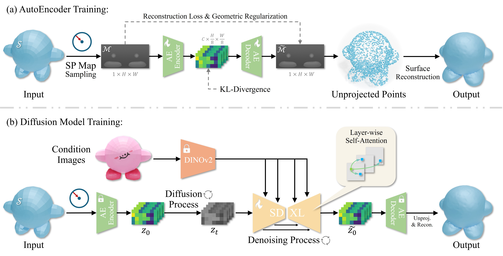

# SPGen: **Spherical Projection as Consistent and Flexible Representation** for Single Image 3D Shape Generation 🌍➡️🧊 [ *SIGGRAPH Asia 2025* ]

<div align="center">

[](https://evergreen0929.github.io/projects/spgen.html)
[](https://arxiv.org/abs/2509.12721)
[](https://youtu.be/ia66Md8T6Bs)

</div>

## :scroll: Introduction

This repository is the official implementation of **SPGen**, a novel framework for high-quality single-image 3D generation.

> **SPGen: Spherical Projection as Consistent and Flexible Representation for Single Image 3D Shape Generation** <br>
> [Jingdong Zhang](https://evergreen0929.github.io/)¹, [Weikai Chen](https://chenweikai.github.io/)²*, [Yuan Liu](https://liuyuan-pal.github.io/)³, [Jionghao Wang](https://shanemankiw.github.io/)¹, [Zhengming Yu](https://yzmblog.github.io/)¹, [Zhuowen Shen](https://mickshen7558.github.io/)¹, [Bo Yang](https://sites.google.com/site/boyanghome/home)⁴, [Wenping Wang](https://scholar.google.com/citations?user=28shvv0AAAAJ&hl=en)¹, [Xin Li](https://people.tamu.edu/~xinli/)¹ <br>
> *¹Texas A&M University, ²LightSpeed Studios, ³HKUST, ⁴Waymo* <br>
> **SIGGRAPH Asia 2025 (Conference Papers)**

Existing single-view 3D generative models often suffer from inter-view inconsistencies or struggle with complex topologies (e.g., internal structures, open surfaces). **SPGen** addresses these limitations by projecting 3D surfaces onto a bounding sphere and unwrapping them into **Multi-layer Spherical Projection (SP) maps**.

**Key Features:**
* **Consistency:** The injective SP mapping naturally eliminates multi-view ambiguity.
* **Flexibility:** Multi-layer design supports nested internal structures and open surfaces.
* **Efficiency:** Operates in the image domain, inheriting powerful 2D priors (SDXL) for fast finetuning.

<p align="center">
  
</p>

## 📝 News
- **[2025-08]** SPGen is accepted to **SIGGRAPH Asia 2025**! 🎉
- **[2025-09]** Paper is available on [arXiv](https://arxiv.org/abs/2509.12721).
- **[Coming Soon]** 🟩 Code and Pretrained Weights will be released soon.

## 🏗️ Method Overview

Our pipeline consists of two stages:
1.  **AutoEncoder Training:** Compressing high-resolution multi-layer SP maps into compact latents with geometry regularization.
2.  **Diffusion Model Training:** Finetuning a latent diffusion model (based on SDXL) with Layer-wise Self-Attention to generate consistent 3D geometry from a single image.

<p align="center">
  
</p>

## 📅 Todo
- [ ] Release inference code.
- [ ] Release pretrained models (AutoEncoder & Diffusion UNet).
- [ ] Release training scripts.
- [ ] Release dataset preparation scripts.

## 📥 Citation
If you find our work and this repository useful, please consider starring the repo and citing our paper:

```bibtex
@inproceedings{zhang2025spgen,
  title={SPGen: Spherical Projection as Consistent and Flexible Representation for Single Image 3D Shape Generation},
  author={Zhang, Jingdong and Chen, Weikai and Liu, Yuan and Wang, Jionghao and Yu, Zhengming and Shen, Zhuowen and Yang, Bo and Wang, Wenping and Li, Xin},
  booktitle={SIGGRAPH Asia 2025 Conference Papers},
  year={2025},
  publisher={ACM},
  doi={10.1145/3757377.3763959}
}
